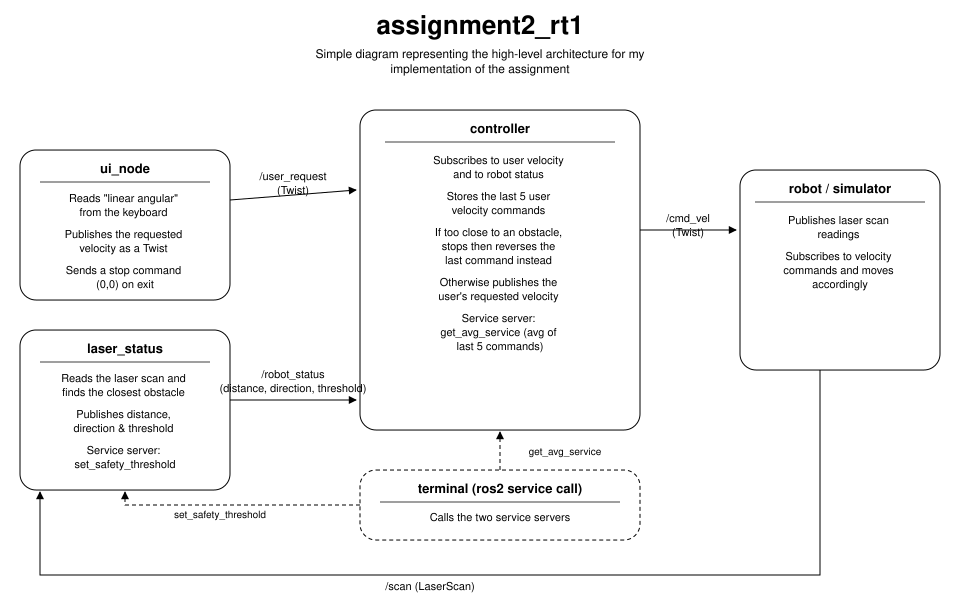

# assignment2_rt1

A ROS 2 package: a robot (or simulator) is driven by user-supplied velocity commands while a laser-based safety layer stops and reverses it whenever it gets too close to an obstacle.



## Repository layout

This repo contains two packages:

- **assignment2_rt1** — the package described below (`ui_node`, `laser_status`, `controller`).
- **bme_gazebo_sensors** — the 3D simulation package used in class (Gazebo world, robot URDF, RViz config). It publishes `/scan` and bridges `/cmd_vel` / `/odom` for the simulated robot. It's included as a subfolder here so the whole thing builds and runs out of the box, and must be built alongside `assignment2_rt1` (see below).

## Nodes

- **ui_node** — reads `linear angular` pairs from the keyboard and publishes them as a `Twist` on `/user_request`.
- **laser_status** — subscribes to `/scan`, finds the closest obstacle and its direction, and publishes a custom `RobotStatus` message (`distance`, `direction`, `threshold`) on `/robot_status`. It also exposes the `set_safety_threshold` service to change the safety distance at runtime.
- **controller** — subscribes to `/user_request` and `/robot_status`. If the robot is within the safety threshold it stops and reverses the last command instead of applying the new one; otherwise it forwards the requested velocity as a `Twist` on `/cmd_vel`. It keeps the last 5 user commands and exposes the `get_avg_service` service, which returns their average linear/angular velocity.

## How to run

Clone this repo into the `src` folder of a ROS 2 workspace and build **both** packages (`bme_gazebo_sensors` provides the simulation, `assignment2_rt1` depends on it at runtime):

```bash
cd ~/ros2_ws/src
git clone https://github.com/Tawakoll/assignment2_rt1.git
cd ~/ros2_ws
colcon build --packages-select bme_gazebo_sensors assignment2_rt1
source install/setup.bash
```

### Using the launch file

`assignment2_rt1.launch.py` starts the simulation (Gazebo + RViz + robot) together with the `laser_status` and `controller` nodes in one command:

```bash
ros2 launch assignment2_rt1 assignment2_rt1.launch.py
```

`ui_node` is kept out of the launch file on purpose — it reads from the keyboard, and `ros2 launch` doesn't forward stdin to launched processes cleanly. Start it by hand, in its own terminal (also sourced with `source install/setup.bash`):

```bash
ros2 run assignment2_rt1 ui_node.py
```

In the `ui_node` terminal, enter a linear and angular velocity separated by a space (e.g. `0.5 0.0`), or `x` to exit.

Under the hood, `assignment2_rt1.launch.py` is a Python launch file (`launch/assignment2_rt1.launch.py`) that uses `IncludeLaunchDescription` to pull in `bme_gazebo_sensors`'s own `spawn_robot.launch.py`, then adds `laser_status` and `controller` as two more `Node` actions — the same pattern shown in class for combining an existing launch file with your own nodes. If you only want the simulation without the control nodes, you can still run `ros2 launch bme_gazebo_sensors spawn_robot.launch.py` directly.

### Running the nodes individually (without the launch file)

```bash
ros2 launch bme_gazebo_sensors spawn_robot.launch.py   # simulation
ros2 run assignment2_rt1 laser_status.py               # in another terminal
ros2 run assignment2_rt1 controller.py                 # in another terminal
ros2 run assignment2_rt1 ui_node.py                     # in another terminal
```

### Calling the services

```bash
# Change the safety threshold (in meters)
ros2 service call /set_safety_threshold assignment2_rt1/srv/SetThreshold "{new_threshold: 1.5}"

# Get the average of the last 5 user commands
ros2 service call /get_avg_service assignment2_rt1/srv/GetAvg
```
